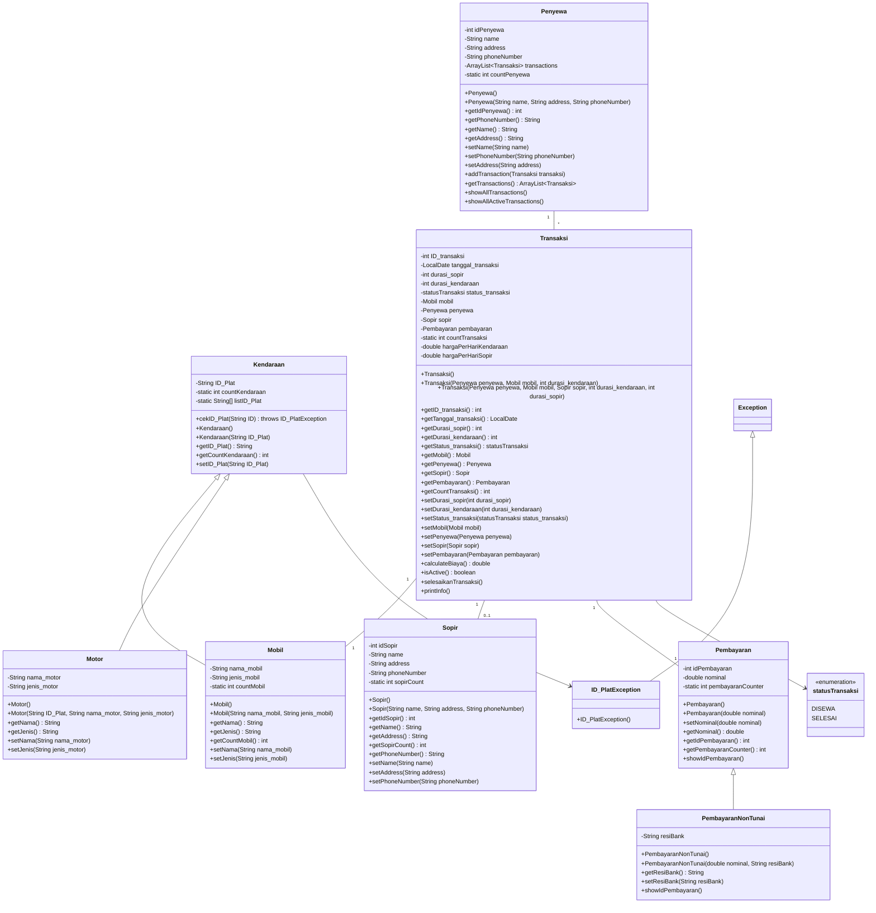

```mermaid

classDiagram
    class Kendaraan {
        -String ID_Plat
        -static int countKendaraan
        -static String[] listID_Plat
        +cekID_Plat(String ID) throws ID_PlatException
        +Kendaraan()
        +Kendaraan(String ID_Plat)
        +getID_Plat() String
        +getCountKendaraan() int
        +setID_Plat(String ID_Plat)
    }

    class Mobil {
        -String nama_mobil
        -String jenis_mobil
        -static int countMobil
        +Mobil()
        +Mobil(String nama_mobil, String jenis_mobil)
        +getNama() String
        +getJenis() String
        +getCountMobil() int
        +setNama(String nama_mobil)
        +setJenis(String jenis_mobil)
    }

    class Motor {
        -String nama_motor
        -String jenis_motor
        +Motor()
        +Motor(String ID_Plat, String nama_motor, String jenis_motor)
        +getNama() String
        +getJenis() String
        +setNama(String nama_motor)
        +setJenis(String jenis_motor)
    }

    class Penyewa {
        -int idPenyewa
        -String name
        -String address
        -String phoneNumber
        -ArrayList~Transaksi~ transactions
        -static int countPenyewa
        +Penyewa()
        +Penyewa(String name, String address, String phoneNumber)
        +getIdPenyewa() int
        +getPhoneNumber() String
        +getName() String
        +getAddress() String
        +setName(String name)
        +setPhoneNumber(String phoneNumber)
        +setAddress(String address)
        +addTransaction(Transaksi transaksi)
        +getTransactions() ArrayList~Transaksi~
        +showAllTransactions()
        +showAllActiveTransactions()
    }

    class Sopir {
        -int idSopir
        -String name
        -String address
        -String phoneNumber
        -static int sopirCount
        +Sopir()
        +Sopir(String name, String address, String phoneNumber)
        +getIdSopir() int
        +getName() String
        +getAddress() String
        +getSopirCount() int
        +getPhoneNumber() String
        +setName(String name)
        +setAddress(String address)
        +setPhoneNumber(String phoneNumber)
    }

    class Transaksi {
        -int ID_transaksi
        -LocalDate tanggal_transaksi
        -int durasi_sopir
        -int durasi_kendaraan
        -statusTransaksi status_transaksi
        -Mobil mobil
        -Penyewa penyewa
        -Sopir sopir
        -Pembayaran pembayaran
        -static int countTransaksi
        -double hargaPerHariKendaraan
        -double hargaPerHariSopir
        +Transaksi()
        +Transaksi(Penyewa penyewa, Mobil mobil, int durasi_kendaraan)
        +Transaksi(Penyewa penyewa, Mobil mobil, Sopir sopir, int durasi_kendaraan, int durasi_sopir)
        +getID_transaksi() int
        +getTanggal_transaksi() LocalDate
        +getDurasi_sopir() int
        +getDurasi_kendaraan() int
        +getStatus_transaksi() statusTransaksi
        +getMobil() Mobil
        +getPenyewa() Penyewa
        +getSopir() Sopir
        +getPembayaran() Pembayaran
        +getCountTransaksi() int
        +setDurasi_sopir(int durasi_sopir)
        +setDurasi_kendaraan(int durasi_kendaraan)
        +setStatus_transaksi(statusTransaksi status_transaksi)
        +setMobil(Mobil mobil)
        +setPenyewa(Penyewa penyewa)
        +setSopir(Sopir sopir)
        +setPembayaran(Pembayaran pembayaran)
        +calculateBiaya() double
        +isActive() boolean
        +selesaikanTransaksi()
        +printInfo()
    }

    class Pembayaran {
        -int idPembayaran
        -double nominal
        -static int pembayaranCounter
        +Pembayaran()
        +Pembayaran(double nominal)
        +setNominal(double nominal)
        +getNominal() double
        +getIdPembayaran() int
        +getPembayaranCounter() int
        +showIdPembayaran()
    }

    class PembayaranNonTunai {
        -String resiBank
        +PembayaranNonTunai()
        +PembayaranNonTunai(double nominal, String resiBank)
        +getResiBank() String
        +setResiBank(String resiBank)
        +showIdPembayaran()
    }

    class ID_PlatException {
        +ID_PlatException()
    }

    class statusTransaksi {
        <<enumeration>>
        DISEWA
        SELESAI
    }

    Kendaraan <|-- Mobil
    Kendaraan <|-- Motor
    Pembayaran <|-- PembayaranNonTunai
    Penyewa "1" -- "*" Transaksi 
    Transaksi "1" -- "1" Mobil 
    Transaksi "1" -- "0..1" Sopir 
    Transaksi "1" -- "1" Pembayaran 
    Exception <|-- ID_PlatException
    Transaksi --> statusTransaksi 
    Kendaraan --> ID_PlatException 

```